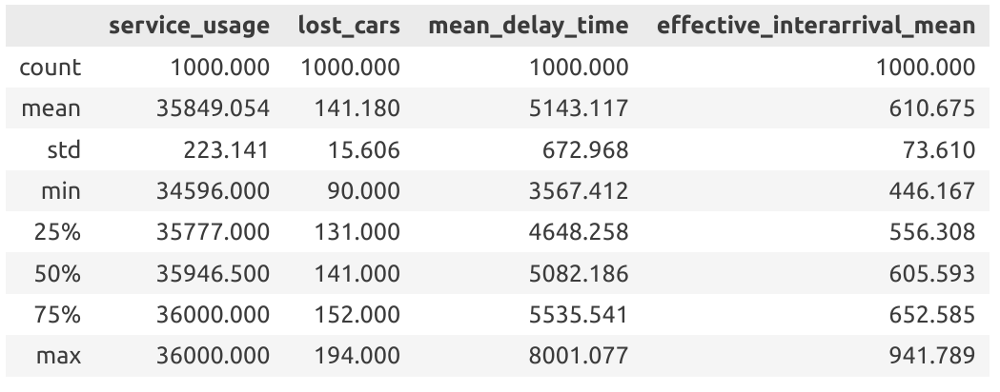
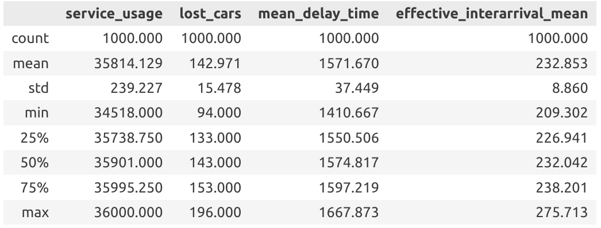
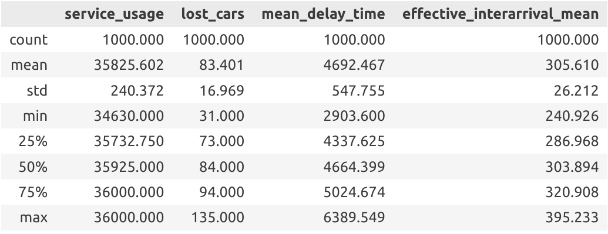

# Informe

## Intro

### Objetivos y metas

El problema original al que nos enfrentamos se basa en dar respuesta a la pregunta: ¿cuántos clientes se pierden en promedio cada día en el lavadero de coches dadas las condiciones planteadas? Algo que podemos solucionar de manera directa utilizando tanto modelos matemáticos como de simulación; pero que también da paso a otras interrogantes que enriquecen al grueso de nuestro proyecto como:

- ¿Cómo se comporta el sistema si los clientes se impacientan y abandonan la cola?
- ¿Será más eficiente el negocio si se tiene una cola con dos servidores, que dos colas por cada servidor?(Una pregunta que intuitivamente parece indicar que sí) ¿Qué sucederá si las colas se mantienen balanceadas?
- ¿Existe alguna relación entre las variables que se encuentran bajo análisis? ¿Y si es así, de qué tipo?
- ¿Qué comportamiento presentan dichas variables? ¿Siguen alguna distribución en particular?

Las respuestas a estás cuestiones constituyen los objetivos y metas de nuestro trabajo.

### Sistema específico. Variables de interés

El **sistema** tratado es un lavadero de autos, representado como un conjunto de máquinas de lavado (servidores) y un conjunto de coches.

Para **modelarlo** abstrajimos el sistema original como una lista de enteros (donde cada coche está representado por uno de estos) y variables booleanas (indican si alguno de los servidores se encuentra en funcionamiento o no). Encontramos este modelo suficiente, dado que contiene la información necesaria para dar respuesta a las interrogantes que enfrentamos, manteniendo solo los detalles indispensables.

Los **estados** del modelo están caracterizados por:

- Cantidad de coches en la cola
- Cantidad de coches siendo atendidos

Las **entidades** del modelo son:

- Coches
- Servidores (máquinas de lavado)

, cuyos **atributos** son:

- identificadores para los coches
- identificadores para los servidores
- estado de funcionamiento de los servidores

Los **eventos** principales del modelo son:

- Arribo de un nuevo coche
- Finalización de lavado de un coche
- Partida de un coche por impaciencia

#### Variables de interés

Para dar soluciones a las objetivos del proyecto tomamos como variables de interés:

- Tiempo de uso de los servidores
- Cantidad de coches perdidos
- Tiempo promedio de espera
- Tiempo inter-arribos promedio

### Variables que describen el problema 

<!-- Son las que están en el latex -->

## Detalles de Implementación

Para la implementación del proyecto nos basamos en el **Event Scheduling/Time Advance Algorithm** (presente en el libro Discrete Event Simulation de Jerry Banks), el cual lo llevamos al contexto de nuestro problema manteniendo una lista de eventos futuros (cuyos posibles tipos fueron comentados previamente) y avanzando el reloj (clock) de evento más inminente al siguiente, mientras las simulaciones son ejecutadas y los futuros eventos son generados.

Como pseudocódigo:

```pseudo
while clock < duration:
    pop imminent event
    advance clock

    if arrival event:
        generate arrival
        generate impatience
        simulate arrival
    
    if departure event:
        simulate departure

    if server available:
        generate departure
        simulate car serving
```


## Resultados y experimentos

### Problema original (Single queue, single server)

Al simular el problema original obtuvimos como respuesta que al día se perdían **141 coches en promedio**; con un **tiempo de espera** medio de 8 minutos, una **utilización del 99.5% del servidor** y un **tiempo inter-arribos efectivo** (tiempo en que los coches arriban a la cola y pueden pasar a esta) promedio de 10 minutos.

Estos buenos resultados del sistema (dada la utilización del servidor), nos llevaron al planteamiento de las siguientes preguntas o hipótesis:

### Hipótesis

- Si los clientes se impacientan y se marchan, el comportamiento del sistema empeorará
- El sistema con otro servidor y una cola, tendrá mejor comportamiento que con otro servidor y dos colas; sin embargo no mejor que con dos colas balanceadas.

#### Clientes impacientes

Una vez realizada la simulación para el sistema con **clientes impacientes** obtuvimos un resultado que refuta nuestra hipótesis; y es que el sistema tiene un mejor comportamiento que con clientes que no abandonan la cola:

**Original system**



**Impatient system**



Como podemos observar, la cantidad de clientes perdidos al día y el tiempo de utilización del servidor en promedio son aproximadamente los mismos, mientras que para el sistema impaciente, se reducen en casi tres veces los tiempos de espera y los tiempos inter-arribos efectivos.

La explicación de este resultado, aparentemente contradictorio, está dada en que las pérdidas de clientes por impaciencias llevan a una reducción en las pérdidas por arribos al sistema lleno, manteniendo el total de clientes perdidos igual para ambos sistemas, y disminuyendo el tiempo inter-arribos efectivo. Además de esto, las salidas por impaciencia lleva a que los clientes que llegan a ser atendidos, pasen un tiempo menor en la cola (aquellos que pasan mucho se marchan de esta); esta última conclusión nos indica también, que si aumentáramos la media de la distribución normal truncada utilizada para modelar los tiempos de impaciencia, estos valores favorables para el sistema impaciente disminuirían.

#### Dos servidores, una o dos colas (¿balanceadas?)

De manera similar a la hipótesis anterior, los resultados obtenidos la refutaron; y es que las variables de interés obtuvieron valores casi idénticos para las tres simulaciones. Con lo que podemos afirmar que ninguna de los tres sistemas posee un mejor comportamiento.

**Single queue**


**Two queues**


**Balanced queues**


### Análisis de parada

Decidimos realizar las simulaciones para un total de 1000 días, una cifra suficientemente grande para obtener valores muy cercanos a los reales, y con la cual el tiempo de cómputo fue lo suficientemente pequeño.